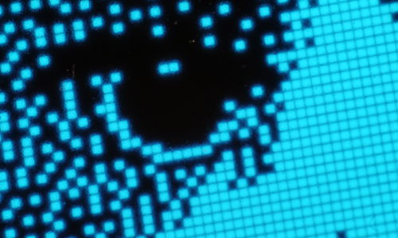

# ATTiny85-SSD1306

Display a random image on an SSD1306-based, I2C-connected
[OLED display](http://www.banggood.com/0_96-Inch-4Pin-Blue-Yellow-IIC-I2C-OLED-Display-Module-For-Arduino-p-969144.html)
with an ATTiny85-based
[Digispark knockoff board](http://www.banggood.com/ATTINY85-Mini-Usb-MCU-Development-Board-For-Arduino-p-971122.html).

The image is not fullscreen because this is a yellow/blue display and I'm only
using the blue part. The I2C code is probably not standards compliant. For
starters it doesn't use any timing delays. In this application, it happens to
"just work".

This project contains a readymade `img.h` of the cat image, to be replaced with
your own. Use the `convert.py` script to convert your own b/w PNG image to the
proper header format. The script takes a b/w PNG file and outputs a C header
with the correct bit format for the display. Check the Makefile and the script
itself for details on how it works.

## License

This program is distributed under the terms of the GNU General Public License
version 3. See `LICENSE` for the full license text.
